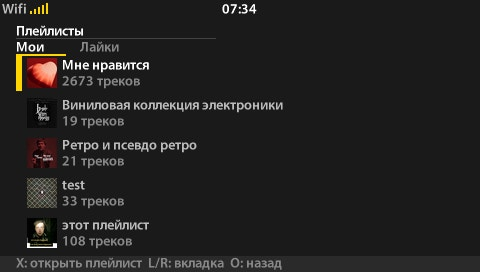
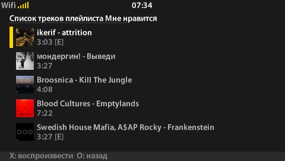
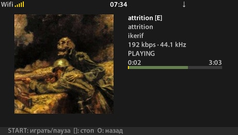

# Yandex Music PSP

Неофициальный клиент Яндекс Музыки для PlayStation Portable. Приложение переносит на PSP основной сценарий портативного плеера: открыть свою медиатеку, выбрать плейлист, запустить трек и управлять очередью без сенсорного экрана и экранной клавиатуры.

Интерфейс рассчитан на экран 480×272 и управление штатными кнопками PSP. В центре внимания — крупная обложка, короткие списки и минимум действий между запуском приложения и музыкой.

## Скриншоты







## Что доступно

### Плейлисты и любимые треки

- Личные плейлисты пользователя.
- Отдельная вкладка с понравившимися плейлистами.
- «Мне нравится» отображается рядом с личными плейлистами как отдельная коллекция треков.
- Обложка и количество треков видны прямо в списке.
- Переключение вкладок выполняется кнопками `L` и `R`.
- При повторном открытии приложение старается вернуть курсор к тому же треку, даже если плейлист был изменён на другом устройстве.

### Список треков

Каждая строка показывает:

- обложку альбома;
- исполнителя и название;
- отдельную приглушённую пометку версии — например, Deluxe или Remix;
- год, продолжительность и жанр;
- отметку `[E]` для explicit-контента.

Длинные плейлисты загружаются вокруг текущего положения курсора. Пока следующая часть списка подготавливается, вместо устаревших данных показывается нейтральный индикатор `...`.

### Воспроизведение

После выбора трека открывается полноэкранный плеер с обложкой и подробной информацией:

- название трека, альбом и список исполнителей;
- версия трека и версия альбома отображаются отдельным более бледным текстом;
- длинные названия плавно прокручиваются в пределах своей области;
- индикатор состояния плеера;
- прошедшее и полное время трека;
- отдельное отображение позиции воспроизведения и загруженной части трека;
- системная шкала громкости;
- год, жанр, битрейт и частота дискретизации, когда они доступны.

Для треков с динамической обложкой приложение может показывать анимацию вместо статичного изображения, если доступен вспомогательный сервис её подготовки. До готовности анимации музыка и обычная обложка остаются приоритетными.

Очередь продолжает играть автоматически. Следующий трек и его обложка подготавливаются ближе к концу текущего, чтобы сократить паузу между композициями. Уже полностью загруженные треки сохраняются на Memory Stick и используются повторно.

### Исполнители

- Список понравившихся исполнителей с фотографиями.
- Жанр, количество альбомов и треков в списке.
- Карточка исполнителя с крупной фотографией и общей статистикой.
- Две вкладки релизов: основные альбомы и другие появления исполнителя.
- Год и версия релиза отображаются непосредственно в списке альбомов.

### Аккаунт

Экран аккаунта показывает имя пользователя, UID, состояние подписки и дату её окончания, если она доступна.

### Сеть и системный статус

Верхняя строка интерфейса показывает:

- текущее время;
- SSID и уровень сигнала Wi-Fi;
- сетевую активность или восстановление подключения;
- включённый `HOLD`;
- заряд и состояние зарядки аккумулятора.

Отдельный экран «Информация о сети» содержит профиль подключения, SSID, BSSID, тип защиты, канал, уровень сигнала, IP-адрес, маску, шлюз и оба DNS-сервера.

Если ошибка сети или авторизации возникает при запуске, приложение показывает этап, на котором остановилось, и позволяет повторить попытку кнопкой `X`.

## Управление

| Кнопка | Действие |
| --- | --- |
| `↑` / `↓` | Перемещение по меню и спискам |
| `X` | Выбор, открытие или запуск трека |
| `O` | Возврат на предыдущий экран |
| `L` / `R` | Переключение вкладок |
| `START` | Пауза или продолжение воспроизведения |
| `□` | Остановка воспроизведения |
| `←` / `→` | Предыдущий или следующий трек на экране плеера |
| `HOME` | Выход через системное меню PSP |

Подсказки для доступных действий отображаются в нижней части каждого экрана.

## Первый запуск

Приложению нужен пользовательский OAuth-токен Яндекса. Гостевого режима и ввода логина на PSP нет.

1. Откройте незаполненный файл `config/token.txt` в каталоге собранного или распакованного приложения.
2. Впишите свой токен между кавычками:

   ```text
   YANDEX_TOKEN = "..."
   ```

3. Скопируйте каталог приложения в `PSP/GAME/YandexMusicPSP/` на Memory Stick.
4. Убедитесь, что рядом с `EBOOT.PBP` находятся `config/token.txt` и обязательный файл `fonts/ui.cbmf`. Каталог `assets` нужен для заставки; рабочие каталоги внутри `data` приложение создаёт само.
5. Включите WLAN и заранее настройте рабочее Wi-Fi-подключение в системном меню PSP.

Заполненный `config/token.txt` с реальным токеном не должен попадать в Git или публичные архивы. Незаполненный шаблон `YANDEX_TOKEN = ""`, создаваемый сборкой, секрета не содержит.

## Текущее состояние

Приложение ориентировано на PSP с ARK-4 или ARK-5 и находится в разработке. Сейчас важно учитывать следующие ограничения:

- поиск на самой PSP отсутствует;
- общий раздел альбомов пока не заполнен;
- «Моя волна», лайк и дизлайк из экрана плеера ещё не подключены;
- динамические обложки требуют отдельно настроенного сервиса подготовки видео;
- для работы требуется сеть, хотя завершённые загрузки повторно берутся с Memory Stick;
- доступность каталога и воспроизведения зависит от аккаунта и условий сервиса Яндекс Музыки.

## Сборка

Для разработки используется PSPSDK:

```sh
make
```

Результат создаётся в `release/EBOOT.PBP`. Команда `make` также копирует отслеживаемые ресурсы из `fonts/` и `assets/` в соответствующие каталоги внутри `release/` и при отсутствии создаёт незаполненный `release/config/token.txt` с параметром `YANDEX_TOKEN = ""`. Перед запуском приложения в этот параметр необходимо вписать пользовательский OAuth-токен, как описано в разделе первого запуска. Уже заполненный файл повторная сборка не перезаписывает.
