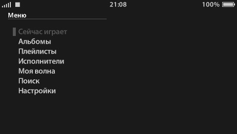

English version: [README.md](README.md)

# YMPSP

Неофициальный клиент Яндекс Музыки для PlayStation Portable.

YMPSP не связан с ООО «Яндекс» и не одобрен им.

## Скриншоты




## Первый запуск

Входить можно двумя способами:

**По коду с телефона .** Откройте пункт «Профиль» в меню (или нажмите `X` на пустом экране аккаунта), введите показанный код на странице `ya.ru/device` и подтвердите. Токен сохранится в `config/token.txt` сам.

**Вручную (рекомендуется).** Откройте незаполненный файл `config/token.txt` в каталоге собранного или распакованного приложения и впишите свой токен между кавычками:

```text
YANDEX_TOKEN = "..."
```

Далее:

1. Скопируйте каталог приложения в `PSP/GAME/YMPSP/` на Memory Stick.
2. Убедитесь, что рядом с `EBOOT.PBP` находятся `assets` и `fonts`. Рабочие каталоги внутри `data` приложение создаёт само.
3. Включите WLAN и заранее настройте рабочее Wi-Fi-подключение в системном меню PSP.

Заполненный `config/token.txt` с реальным токеном не должен попадать в Git или публичные архивы. Незаполненный шаблон `YANDEX_TOKEN = ""`, создаваемый сборкой, секрета не содержит.

## Текущее состояние

Приложение ориентировано на PSP с ARK-4 или ARK-5 и находится в разработке.

## Сборка

Для разработки используется PSPSDK. Из корня проекта:

В Linux:

```
make
```

В PowerShell:

```
wsl --shell-type login make
```

Результат создаётся в `release/EBOOT.PBP`. Команда `make` также копирует отслеживаемые ресурсы из `fonts/` и `assets/` в соответствующие каталоги внутри `release/` и при отсутствии создаёт незаполненный `release/config/token.txt` с параметром `YANDEX_TOKEN = ""`. Токен можно вписать туда заранее, а можно войти по коду уже на приставке — повторная сборка заполненный файл не перезаписывает.

## Лицензия

Исходный код распространяются по лицензии MIT — см. [LICENSE](LICENSE).

Названия и товарные знаки Яндекса принадлежат их правообладателям и лицензией MIT не покрываются. Изображения музыкальных обложек, видимые на скриншотах, также принадлежат соответствующим правообладателям.
